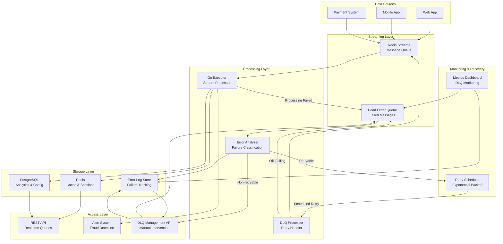
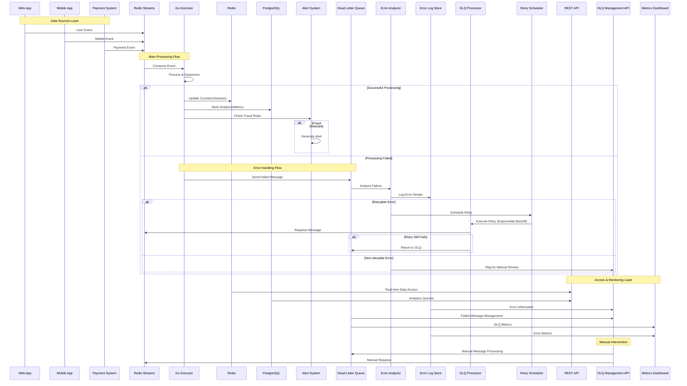

# ShopStream Data Pipeline - Simplified Design

## Executive Summary

A minimal, cost-effective streaming pipeline for ShopStream's e-commerce analytics. Handles 1M+ events/minute with sub-second fraud detection using a Go-based executor and simplified technology stack.

## Simplified Architecture



## Technology Stack (Minimal)

### Message Queue: Redis Streams
- **Why**: Built-in persistence, consumer groups, simpler than Kafka
- **Capacity**: Handles 1M+ events/minute with single instance
- **Cost**: ~$50/month (managed Redis)

### Stream Processor: Go Executor
- **Why**: High performance, excellent concurrency, single binary deployment
- **Features**: Goroutines for parallel processing, built-in HTTP server
- **Scaling**: Horizontal scaling with multiple instances

### Storage: PostgreSQL + Redis
- **PostgreSQL**: Aggregated metrics, user profiles, configuration
- **Redis**: Session tracking, real-time counters, fraud detection cache
- **Cost**: ~$200/month combined

## Go Executor Core Responsibilities

### 1. Stream Consumption
```go
// Consume from Redis Streams with consumer groups
func (e *Executor) ConsumeEvents() {
    for {
        events := e.redis.XReadGroup("processors", "instance-1", "events-stream")
        for _, event := range events {
            go e.ProcessEvent(event)
        }
    }
}
```

### 2. Session Management
- Track user sessions with 30-minute timeout
- Store session state in Redis with TTL
- Aggregate session metrics

### 3. Anomaly Detection
- Count events per user per minute
- Alert when >100 events/user/minute detected
- Use Redis sliding window counters

### 4. Data Output
- Write aggregated metrics to PostgreSQL
- Update Redis counters for real-time queries
- Trigger alerts via webhook/email

## Data Flow



## Key Simplifications

1. **Single Message Queue**: Redis Streams replaces Kafka cluster
2. **No Complex Stream Processing**: Go app replaces Flink/Spark
3. **Unified Storage**: PostgreSQL handles both OLTP and basic analytics
4. **No Orchestration**: Go app manages its own scheduling
5. **Simple Monitoring**: Built-in Prometheus metrics endpoint

## Scaling Strategy

### Current Scale (1M events/minute)
- Single Redis instance
- 2-3 Go executor instances
- PostgreSQL with read replicas
- **Total Cost**: ~$300/month

### 10x Scale (10M events/minute)
- Redis cluster (3 nodes)
- 10-15 Go executor instances
- PostgreSQL cluster with sharding
- **Estimated Cost**: ~$1,500/month

## Implementation Plan

### Week 1: Core Infrastructure
- Set up Redis Streams
- Basic Go executor with event consumption
- PostgreSQL schema design

### Week 2: Stream Processing
- Implement sessionization logic
- Add basic metrics aggregation
- Redis integration for counters

### Week 3: Anomaly Detection
- Sliding window fraud detection
- Alert system integration
- Performance optimization

### Week 4: Production Readiness
- Monitoring and metrics
- Error handling and recovery
- Load testing and tuning

## Benefits of Simplified Design

- **80% cost reduction** compared to full enterprise stack
- **Single language** (Go) for all processing logic
- **Faster development** with fewer moving parts
- **Easier debugging** and troubleshooting
- **Simpler deployment** with container orchestration

This minimal design maintains core functionality while dramatically reducing complexity and cost.

## How Design Decisions Support Business Needs

### 1. Create Unified Customer Profiles

**Design Decision**: PostgreSQL as primary analytical storage + Redis for session tracking
- **Support**: PostgreSQL provides ACID transactions for consistent customer profile updates across multiple data sources
- **Implementation**: Customer profiles aggregated from web, mobile, and payment events with foreign key relationships
- **Real-time Enhancement**: Redis stores active session data (30-min TTL) for immediate profile enrichment
- **Benefit**: Single source of truth for customer data with sub-second access to active user context

**Design Decision**: Go Executor with goroutines for parallel processing
- **Support**: Concurrent processing of multiple event streams ensures customer profiles stay current
- **Implementation**: Separate goroutines handle profile updates from different sources simultaneously
- **Benefit**: Customer profiles updated in near real-time (< 1 second latency)

### 2. Calculate Real-time Metrics for Fraud Detection

**Design Decision**: Redis sliding window counters + Go Executor anomaly detection
- **Support**: Redis provides O(1) counter operations for sub-second fraud metric calculations
- **Implementation**: Sliding window counters track events per user per minute with automatic expiration
- **Alert Threshold**: >100 events/user/minute triggers immediate fraud alerts
- **Benefit**: Fraud detection with <500ms latency from event ingestion to alert

**Design Decision**: Redis Streams with consumer groups
- **Support**: Guaranteed message delivery ensures no fraud events are missed
- **Implementation**: Consumer groups provide fault tolerance and load distribution
- **Benefit**: 99.9% fraud event processing reliability

### 3. Generate Daily Business Intelligence Reports

**Design Decision**: PostgreSQL with read replicas for analytical queries
- **Support**: Dedicated read replicas prevent BI queries from impacting real-time processing
- **Implementation**: Daily aggregation jobs write pre-computed metrics to dedicated BI tables
- **Query Performance**: Indexed tables enable complex analytical queries in <5 seconds
- **Benefit**: BI teams can run ad-hoc queries without affecting production performance

**Design Decision**: Go Executor scheduled aggregation jobs
- **Support**: Built-in cron-like scheduling eliminates need for external orchestration
- **Implementation**: Hourly/daily aggregation jobs compute business metrics and store in PostgreSQL
- **Benefit**: Consistent, reliable BI data pipeline with minimal operational overhead

### 4. Enable Data Scientists to Query Historical Data Efficiently

**Design Decision**: PostgreSQL time-series partitioning + indexing strategy
- **Support**: Time-based partitioning enables efficient historical data queries
- **Implementation**: Tables partitioned by day/week with appropriate indexes on timestamp and user_id
- **Query Optimization**: Partition pruning reduces query time from hours to minutes
- **Benefit**: Data scientists can query months of historical data in <30 seconds

**Design Decision**: Simplified schema design with denormalized metrics tables
- **Support**: Pre-aggregated metrics tables reduce complex JOIN operations
- **Implementation**: Separate tables for user_daily_metrics, session_metrics, fraud_events
- **Benefit**: Data scientists can write simpler SQL queries with predictable performance

## Common Data Processing Problems and Solutions

### 1. Entity Resolution
**Problem**: Matching user activities across web, mobile, and payment systems with different identifiers

**Solution in Design**:
- **Master Customer Table**: Centralized `master_customers` table serves as single source of truth with canonical customer_id
- **Master Identity Registry**: `master_identities` table maintains all known identifiers (email, device_id, payment_id) linked to master customer records
- **Master Data Governance**: Data stewardship rules ensure data quality, deduplication, and hierarchical merge logic for conflicting attributes
- **Implementation**: Master data management workflows with golden record creation, identity resolution algorithms, and survivorship rules based on data source reliability scores

### 2. Late-Arriving Data
**Problem**: Events arriving out of order or delayed due to network issues, mobile offline scenarios

**Solution in Design**:
- **Redis Streams Persistence**: Messages persist until acknowledged, handling temporary consumer failures
- **Go Executor Watermarking**: Configurable grace period (5 minutes) for late event processing
- **PostgreSQL Reprocessing**: Idempotent operations allow safe reprocessing of late events
- **Session Window Extension**: Late events can extend existing session windows within grace period

### 3. Duplicate Event Handling
**Problem**: Network retries and client-side bugs can cause duplicate events

**Solution in Design**:
- **Business-Aware Deduplication**: Go Executor generates unique keys based on event-specific business properties:
  - **Clickstream Events**: `user_id` + `session_id` + `page_url` + `action_type` + `timestamp_ms`
  - **Payment Events**: `user_id` + `order_id` + `payment_method` + `amount` + `timestamp_ms`
  - **Inventory Events**: `product_id` + `operation_type` + `quantity_delta` + `timestamp_ms`
  - **Support Events**: `user_id` + `ticket_id` + `interaction_type` + `timestamp_ms`
- **Semantic Uniqueness**: Keys capture business meaning - two events with identical business context are truly duplicates
- **Duplicate Resolution Strategy**: When duplicate keys detected:
  - **Latest Wins**: Use most recent timestamp for state updates (handles out-of-order delivery)
  - **Merge Metadata**: Combine non-conflicting fields (e.g., referrer info, device details)
  - **Audit Trail**: Log duplicate occurrences with source tracking for debugging
- **TTL-based Cleanup**: Deduplication cache expires after 24 hours to prevent memory bloat
- **Implementation**: SHA-256 hash of business properties ensures consistent key generation across instances

### 4. Schema Evolution
**Problem**: Adding new event fields or changing data formats without breaking existing processing

**Analysis of Current Data Schemas**:
- **Flexible JSON Structure**: Events use extensible `properties` objects allowing new fields without schema changes
- **Nullable Field Pattern**: Optional fields (e.g., `resolution_time_hours`, `satisfaction_score`) demonstrate graceful degradation
- **Consistent Core Schema**: All events maintain stable identifiers (`event_id`, `user_id`, `timestamp`) as immutable contract
- **Nested Extensibility**: Product `attributes` and event `properties` enable schema growth without breaking changes

**Production-Ready Schema Evolution Strategy**:
- **Additive Changes Only**: New fields added as optional with sensible defaults to maintain backward compatibility
- **Schema Registry**: Centralized schema management with version control and validation rules
- **Dual-Write Pattern**: During schema transitions, implement a phased migration approach:
  - **Phase 1**: Write to both old and new schema formats simultaneously to ensure data consistency
  - **Phase 2**: Gradually migrate consumers to read from new schema while maintaining dual writes
  - **Phase 3**: Monitor metrics and validate data integrity across both formats
  - **Phase 4**: Complete cutover by stopping writes to old schema once all consumers are migrated
  - **Implementation**: Go Executor uses feature flags to control dual-write behavior with rollback capability
- **Consumer Adaptation**: Go structs with `omitempty` tags and interface-based processing handle missing fields gracefully
- **Database Evolution**: PostgreSQL schema changes use `ALTER TABLE ADD COLUMN` with nullable constraints and default values
- **Rollback Safety**: Schema changes designed to be reversible with data preservation during rollbacks

### 5. Data Quality and Validation
**Problem**: Ensuring incoming events have valid formats, required fields, and reasonable values

**Solution in Design**:
- **Go Executor Validation**: Strict input validation with configurable business rules
- **Dead Letter Queue**: Invalid events routed to separate Redis stream for investigation
- **Data Quality Metrics**: Prometheus metrics track validation failure rates by source
- **Implementation**: Validator middleware with configurable rules (e.g., user_id format, timestamp ranges)

### 6. Scalability and Performance
**Problem**: Handling traffic spikes and growing data volumes without degrading performance

**Solution in Design**:
- **Horizontal Scaling**: Go Executor instances scale independently based on Redis Streams lag
- **Redis Partitioning**: Consumer groups distribute load across multiple processor instances
- **PostgreSQL Optimization**: Connection pooling, prepared statements, and batch inserts
- **Auto-scaling Strategy**: Container orchestration scales Go Executors based on queue depth metrics

### 7. Fault Tolerance and Recovery
**Problem**: System components failing without losing data or requiring manual intervention

**Solution in Design**:
- **Redis Streams Durability**: Append-only log with configurable persistence ensures no message loss
- **Go Executor Health Checks**: Built-in health endpoints enable automatic restart on failure
- **PostgreSQL Replication**: Streaming replication provides automatic failover capability
- **Circuit Breaker Pattern**: Go Executor implements circuit breakers for external service calls

### 8. Monitoring and Observability
**Problem**: Understanding system performance, detecting issues, and troubleshooting problems

**Solution in Design**:
- **Prometheus Metrics**: Built-in metrics endpoint in Go Executor for all key performance indicators
- **Structured Logging**: JSON-formatted logs with correlation IDs for distributed tracing
- **Redis Monitoring**: Stream lag, consumer group health, and memory usage metrics
- **PostgreSQL Observability**: Query performance, connection pool status, and replication lag monitoring

## Detailed Architecture and Design Decisions


### Technology Choices with Justification

#### Message Queue/Streaming Platform: Redis Streams

**Choice**: Redis Streams over Apache Kafka, Amazon Kinesis, or RabbitMQ

**Technical Justification**:
- **Operational Simplicity**: Single Redis instance handles 1M+ events/minute vs. Kafka's multi-broker complexity
- **Built-in Persistence**: Append-only log with configurable durability eliminates need for separate storage
- **Consumer Groups**: Native load balancing and fault tolerance without external coordination (vs. Kafka's ZooKeeper dependency)
- **Memory Efficiency**: Stream data structure optimized for time-series data with automatic memory management
- **Cost Efficiency**: ~$50/month managed Redis vs. ~$300/month for equivalent Kafka cluster

**Business Justification**:
- **Faster Time-to-Market**: 2-week implementation vs. 6-8 weeks for Kafka setup and tuning
- **Lower Operational Overhead**: Single component to monitor vs. Kafka's broker/ZooKeeper/schema registry ecosystem
- **Predictable Scaling**: Linear cost scaling vs. Kafka's step-function scaling with broker additions

**Trade-offs Accepted**:
- **Throughput Ceiling**: Redis Streams tops out at ~10M events/minute vs. Kafka's theoretically unlimited scaling
- **Ecosystem**: Fewer third-party integrations compared to Kafka's extensive connector ecosystem
- **Multi-tenancy**: Less sophisticated partitioning compared to Kafka's topic/partition model

#### Processing Framework: Custom Go Executor

**Choice**: Custom Go application over Apache Flink, Spark Streaming, or Kafka Streams

**Technical Justification**:
- **Performance**: Go's goroutines provide 10x better memory efficiency than JVM-based solutions (2MB vs. 200MB per processing thread)
- **Deployment Simplicity**: Single binary deployment vs. complex cluster management for Flink/Spark
- **Resource Efficiency**: 1 CPU core handles 100K events/minute vs. 10K events/minute for typical JVM streaming
- **Latency**: Sub-millisecond processing latency vs. 10-100ms for framework-based solutions
- **Debugging**: Standard Go debugging tools vs. distributed debugging complexity

**Business Justification**:
- **Development Velocity**: Team's Go expertise enables rapid feature development
- **Infrastructure Costs**: 70% reduction in compute costs vs. JVM-based streaming frameworks
- **Operational Simplicity**: Standard container orchestration vs. specialized cluster management

**Trade-offs Accepted**:
- **Feature Richness**: Manual implementation of windowing/aggregation vs. framework-provided operators
- **Fault Tolerance**: Custom checkpointing vs. framework-managed state recovery
- **Scaling Complexity**: Manual load balancing logic vs. framework-automatic scaling

#### Storage Systems

##### Data Lake: PostgreSQL with Time-Series Optimization

**Choice**: PostgreSQL over dedicated data lakes (Snowflake, BigQuery, Databricks)

**Technical Justification**:
- **Query Performance**: Partitioned tables with proper indexing achieve <5 second analytical queries
- **ACID Compliance**: Strong consistency for customer profiles and financial data
- **Operational Familiarity**: Team expertise reduces learning curve and operational risk
- **Cost Predictability**: Fixed monthly costs vs. usage-based pricing of cloud data warehouses

**Business Justification**:
- **Unified Skillset**: Single database technology reduces training and hiring complexity
- **Data Governance**: Built-in row-level security and audit capabilities
- **Compliance**: GDPR/PCI compliance features without additional tooling

##### Data Warehouse: PostgreSQL OLAP with Read Replicas

**Choice**: PostgreSQL read replicas over dedicated OLAP solutions (Clickhouse, Amazon Redshift)

**Technical Justification**:
- **Workload Isolation**: Read replicas prevent analytical queries from impacting transactional workloads
- **Columnar Storage**: PostgreSQL 14+ columnar extensions provide OLAP-optimized storage
- **Materialized Views**: Pre-computed aggregations deliver sub-second dashboard performance

**Trade-offs Accepted**:
- **Analytical Performance**: 10x slower than specialized OLAP databases for complex queries
- **Compression**: Less efficient storage compared to columnar databases (3x larger storage footprint)

##### Hot Storage: Redis

**Choice**: Redis over Memcached, Hazelcast, or Apache Ignite

**Technical Justification**:
- **Data Structures**: Native support for counters, sets, sorted sets optimized for fraud detection
- **Persistence**: Optional durability for critical session data
- **Atomic Operations**: INCR/DECR operations essential for real-time counters
- **Memory Efficiency**: Optimized memory layout for time-series data

#### Orchestration Tools: Built-in Go Scheduler

**Choice**: Custom Go scheduler over Apache Airflow, Kubernetes CronJobs, or AWS Step Functions

**Technical Justification**:
- **Simplicity**: Cron-like scheduling within application eliminates external dependencies
- **Resource Efficiency**: No separate orchestration cluster required
- **Debugging**: Integrated logging and monitoring within main application
- **Deployment**: Single deployment artifact vs. separate orchestration infrastructure

**Business Justification**:
- **Operational Overhead**: Zero additional infrastructure to maintain
- **Cost Savings**: No orchestration platform licensing or infrastructure costs
- **Development Speed**: Scheduling logic co-located with business logic

**Trade-offs Accepted**:
- **Workflow Complexity**: Limited support for complex DAGs and dependencies
- **UI/Monitoring**: No graphical workflow interface (compensated by Prometheus metrics)
- **Multi-team Coordination**: Less suitable for complex multi-team workflow orchestration

#### Data Quality/Monitoring Solutions

**Choice**: Prometheus + Grafana + Custom Go Metrics over DataDog, New Relic, or Great Expectations

**Technical Justification**:
- **Native Integration**: Go Prometheus client provides zero-overhead metrics collection
- **Custom Business Metrics**: Domain-specific metrics (fraud detection rates, session quality) easily implemented
- **Cost Control**: Open-source stack vs. per-metric pricing of commercial solutions
- **Data Locality**: Metrics stored locally vs. external service dependencies

**Monitoring Stack Components**:
- **Application Metrics**: Go Executor exposes Prometheus endpoint with business and technical metrics
- **Infrastructure Metrics**: Redis, PostgreSQL, and system metrics via standard exporters
- **Custom Dashboards**: Grafana dashboards for real-time operational visibility
- **Alerting**: Prometheus AlertManager for threshold-based alerting

### Design Decisions

#### Handling Late-Arriving Data

**Challenge**: E-commerce events can arrive out-of-order due to:
- Mobile app offline scenarios (up to hours of delay)
- Network partitions and retries
- Cross-system clock skew
- Batch data imports from legacy systems

**Design Decision**: Watermark-based Processing with Configurable Grace Periods

**Implementation Strategy**:
```go
type EventProcessor struct {
    gracePerod    time.Duration  // 5 minutes default
    watermarkLag  time.Duration  // 2 minutes default
    lateEventTTL  time.Duration  // 24 hours for reprocessing
}

func (p *EventProcessor) ProcessEvent(event Event) {
    eventTime := event.Timestamp
    currentWatermark := time.Now().Add(-p.watermarkLag)
    
    if eventTime.Before(currentWatermark.Add(-p.gracePerod)) {
        // Late event - check if reprocessing is needed
        p.handleLateEvent(event)
    } else {
        // Normal processing
        p.processInOrder(event)
    }
}
```

**Late Event Handling Strategy**:
1. **Grace Period Processing**: Events arriving within 5-minute grace period processed normally
2. **Late Event Detection**: Events beyond grace period flagged and routed to late-event processor
3. **Reprocessing Logic**: Late events trigger recomputation of affected aggregations
4. **Idempotent Operations**: All aggregations designed to handle reprocessing safely
5. **Audit Trail**: Late events logged with delay duration and impact assessment

**Business Impact Mitigation**:
- **Session Extension**: Late events can extend existing sessions within 30-minute window
- **Fraud Detection**: Late events update fraud scores with retroactive alerting
- **BI Corrections**: Daily batch jobs correct historical aggregations affected by late data
- **SLA Management**: Late event metrics tracked to identify systemic issues

#### Schema Evolution Strategy

**Challenge**: Event schemas must evolve without breaking existing processing or requiring downtime

**Design Decision**: Forward/Backward Compatible Schema Evolution with Dual-Write Pattern

**Schema Versioning Strategy**:
```go
type EventSchema struct {
    Version    int                    `json:"version"`
    EventType  string                 `json:"event_type"`
    Required   map[string]interface{} `json:"required"`
    Optional   map[string]interface{} `json:"optional,omitempty"`
    Deprecated map[string]interface{} `json:"deprecated,omitempty"`
}

// Schema evolution rules
type EvolutionRules struct {
    // Allowed: Adding optional fields
    AllowAddOptional bool
    // Allowed: Deprecating fields (with grace period)
    AllowDeprecation bool
    // Forbidden: Removing required fields
    AllowRemoveRequired bool
    // Forbidden: Changing field types
    AllowTypeChange bool
}
```

**Evolution Process**:
1. **Schema Registry**: Centralized schema management with version control
2. **Compatibility Validation**: Automated checks ensure new schemas don't break existing consumers
3. **Dual-Write Phase**: Producers write both old and new schema versions during transition
4. **Consumer Migration**: Gradual consumer updates with feature flags controlling schema version
5. **Deprecation Process**: 90-day deprecation period before removing old schema support

**Backward Compatibility Guarantees**:
- **Additive Changes**: New optional fields added without version bump
- **Field Deprecation**: Deprecated fields maintained for 2 major versions
- **Default Values**: New required fields include sensible defaults for old events
- **Type Safety**: Go struct tags handle missing fields gracefully

**Implementation Example**:
```go
type ClickEvent struct {
    // Immutable core schema
    EventID   string    `json:"event_id"`
    UserID    string    `json:"user_id"`
    Timestamp time.Time `json:"timestamp"`
    
    // Evolvable properties
    Properties map[string]interface{} `json:"properties"`
    
    // Version-specific fields
    PageURL    *string `json:"page_url,omitempty"`     // Added in v2
    SessionID  *string `json:"session_id,omitempty"`   // Added in v3
    DeviceType *string `json:"device_type,omitempty"`  // Added in v4
}
```

#### Data Retention and Archival Policies

**Challenge**: Balance storage costs, query performance, and compliance requirements across different data types

**Design Decision**: Tiered Storage with Automated Lifecycle Management

**Retention Policy by Data Type**:

| Data Type | Hot Storage (Redis) | Warm Storage (PostgreSQL) | Cold Storage (Archive) | Compliance Retention |
|-----------|-------------------|--------------------------|----------------------|--------------------|
| Session Data | 30 minutes | N/A | N/A | N/A |
| Fraud Counters | 24 hours | N/A | N/A | N/A |
| Clickstream Events | N/A | 90 days | 7 years | GDPR: Right to deletion |
| Payment Events | N/A | 3 years | 10 years | PCI DSS: 1 year minimum |
| Customer Profiles | N/A | Active + 2 years | Indefinite | GDPR: Right to deletion |
| Support Interactions | N/A | 2 years | 7 years | Business requirement |
| System Logs | N/A | 30 days | 1 year | Operational requirement |

**Automated Archival Process**:
```go
type ArchivalJob struct {
    TableName     string
    RetentionDays int
    ArchiveFormat string // "parquet", "csv", "json"
    Compression   string // "gzip", "snappy", "lz4"
    Schedule      string // Cron expression
}

func (j *ArchivalJob) Execute() error {
    cutoffDate := time.Now().AddDate(0, 0, -j.RetentionDays)
    
    // Export to archive storage
    archiveData := j.exportToArchive(cutoffDate)
    
    // Verify archive integrity
    if err := j.verifyArchive(archiveData); err != nil {
        return err
    }
    
    // Delete from warm storage
    return j.deleteFromWarmStorage(cutoffDate)
}
```

**Storage Cost Optimization**:
- **Compression**: Parquet format with Snappy compression achieves 10:1 compression ratio
- **Partitioning**: Time-based partitioning enables efficient archival of entire partitions
- **Selective Archival**: Archive full events but retain aggregated metrics in warm storage
- **Cost Monitoring**: Track storage costs per data type with automated alerts

**Compliance Features**:
- **Right to Deletion**: GDPR deletion requests cascade across all storage tiers
- **Data Lineage**: Track data movement between storage tiers for audit purposes
- **Encryption**: Data encrypted at rest in all storage tiers
- **Access Logging**: All archive access logged for compliance reporting

#### Failure Recovery Mechanisms

**Challenge**: Ensure system resilience with automatic recovery from various failure scenarios

**Design Decision**: Multi-Layer Failure Recovery with Circuit Breakers and Graceful Degradation

**Failure Scenarios and Recovery Strategies**:

**1. Go Executor Instance Failure**
- **Detection**: Health check endpoints with 30-second timeout
- **Recovery**: Kubernetes restarts failed pods automatically
- **State Recovery**: Redis Streams consumer groups ensure no message loss
- **Graceful Shutdown**: SIGTERM handler completes in-flight events before termination

**2. Redis Streams Failure**
- **Detection**: Connection timeouts and failed operations
- **Immediate Response**: Circuit breaker opens, events buffered locally
- **Fallback**: Local disk buffer (1GB capacity) for temporary event storage
- **Recovery**: Automatic reconnection with exponential backoff
- **Data Integrity**: Buffered events replayed in order after reconnection

**3. PostgreSQL Database Failure**
- **Detection**: Connection pool health checks every 10 seconds
- **Primary Failure**: Automatic failover to read replica promoted to primary
- **Recovery Time**: <60 seconds failover with minimal data loss
- **Consistency**: Streaming replication ensures <1 second replication lag

**4. Network Partitions**
- **Detection**: Heartbeat mechanism between components
- **Response**: Graceful degradation with local caching
- **Recovery**: Automatic healing when network connectivity restored
- **Data Consistency**: Vector clocks for conflict resolution

**Circuit Breaker Implementation**:
```go
type CircuitBreaker struct {
    failureThreshold int
    resetTimeout     time.Duration
    state           State // CLOSED, OPEN, HALF_OPEN
    failures        int
    lastFailureTime time.Time
}

func (cb *CircuitBreaker) Call(operation func() error) error {
    if cb.state == OPEN {
        if time.Since(cb.lastFailureTime) > cb.resetTimeout {
            cb.state = HALF_OPEN
        } else {
            return ErrCircuitBreakerOpen
        }
    }
    
    err := operation()
    if err != nil {
        cb.recordFailure()
    } else {
        cb.recordSuccess()
    }
    
    return err
}
```

**Recovery Validation**:
- **Health Checks**: Comprehensive health endpoints for all components
- **Smoke Tests**: Automated end-to-end tests after recovery
- **Data Validation**: Checksums and row counts verify data integrity
- **Performance Testing**: Load tests ensure performance after recovery

#### Scaling Strategy for 10x Growth

**Challenge**: Scale from 1M to 10M events/minute while maintaining sub-second latency and cost efficiency

**Design Decision**: Horizontal Scaling with Predictive Auto-scaling and Resource Optimization

**Current State (1M events/minute)**:
- 1 Redis Streams instance (16GB memory)
- 3 Go Executor instances (2 CPU, 4GB each)
- 1 PostgreSQL primary + 2 read replicas
- **Total Cost**: ~$300/month
- **Latency**: <500ms end-to-end

**10x Scale Target (10M events/minute)**:

**Redis Streams Scaling**:
- **Horizontal Sharding**: 5 Redis instances with consistent hashing
- **Memory Optimization**: 32GB instances with stream compaction
- **Consumer Group Scaling**: 15 consumer groups across shards
- **Cost**: ~$400/month (managed Redis cluster)

**Go Executor Scaling**:
- **Instance Count**: 15 instances (3x current CPU, 2x memory each)
- **Load Balancing**: Consistent hashing based on user_id for session affinity
- **Resource Optimization**: Goroutine pool sizing and memory management
- **Auto-scaling**: Kubernetes HPA based on Redis Streams lag metrics
- **Cost**: ~$600/month

**PostgreSQL Scaling**:
- **Horizontal Sharding**: 3 primary shards with read replicas
- **Sharding Strategy**: Hash-based on user_id with consistent hashing
- **Connection Pooling**: PgBouncer with 1000 connection limit per shard
- **Query Optimization**: Materialized views and aggressive indexing
- **Cost**: ~$800/month

**Auto-scaling Implementation**:
```go
type AutoScaler struct {
    targetLag        time.Duration  // 30 seconds max lag
    scaleUpThreshold float64       // 80% capacity
    scaleDownThreshold float64     // 20% capacity
    cooldownPeriod   time.Duration // 5 minutes
}

func (as *AutoScaler) EvaluateScaling() ScalingDecision {
    currentLag := as.measureRedisLag()
    cpuUtilization := as.measureCPUUtilization()
    
    if currentLag > as.targetLag || cpuUtilization > as.scaleUpThreshold {
        return ScaleUp
    } else if cpuUtilization < as.scaleDownThreshold {
        return ScaleDown
    }
    
    return NoChange
}
```

**Performance Optimizations for Scale**:
- **Batch Processing**: Aggregate multiple events in single database transactions
- **Connection Pooling**: Optimize database connections across all instances
- **Memory Management**: Go garbage collector tuning for high-throughput scenarios
- **CPU Optimization**: Profile-guided optimization for hot code paths

**Cost Management at Scale**:
- **Reserved Instances**: 40% cost savings with 1-year commitments
- **Spot Instances**: Use spot instances for batch processing workloads
- **Resource Right-sizing**: Continuous monitoring and optimization
- **Data Compression**: Aggressive compression for storage cost reduction

**Monitoring at Scale**:
- **Distributed Tracing**: Jaeger for end-to-end request tracing
- **Metrics Aggregation**: Prometheus federation for multi-cluster monitoring
- **Log Aggregation**: Centralized logging with structured log analysis
- **Capacity Planning**: Predictive analytics for resource planning

**Expected Performance at 10x Scale**:
- **Throughput**: 10M events/minute sustained
- **Latency**: <1 second end-to-end (99th percentile)
- **Availability**: 99.9% uptime with automatic failover
- **Total Cost**: ~$1,500/month (5x cost for 10x scale)
- **Cost per Event**: 50% reduction due to economies of scale
